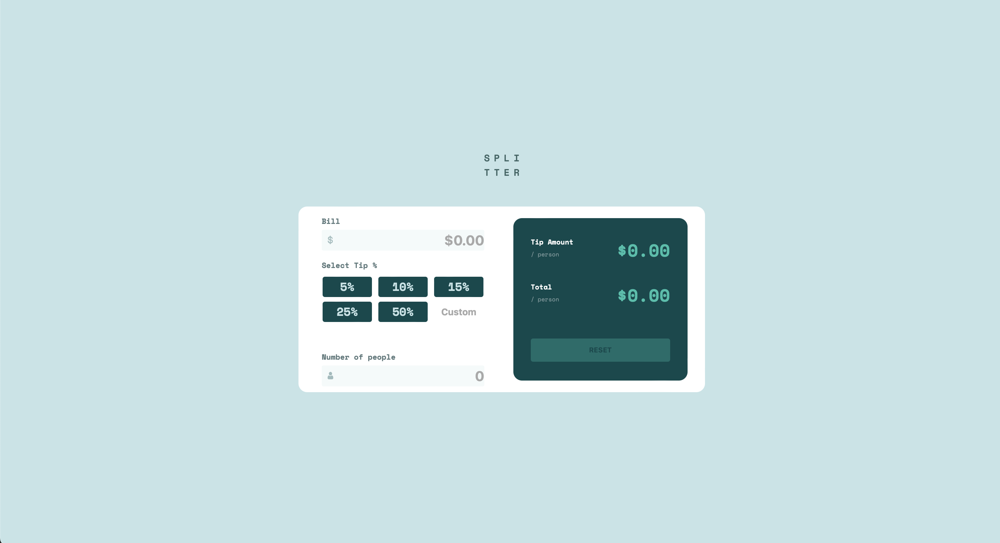

# Tip Calculator

## Table of contents

- [Overview](#overview)
  - [The challenge](#the-challenge)
  - [Screenshot](#screenshot)
  - [Links](#links)
- [My process](#my-process)
  - [Built with](#built-with)
  - [What I learned](#what-i-learned)
  - [Continued development](#continued-development)
  - [Useful resources](#useful-resources)
- [Author](#author)
- [Acknowledgments](#acknowledgments)


## Overview

### The challenge

Users should be able to:

- See hover states for all interactive elements on the page
- Calculate tips about a predetermined base (5 - 10 - 15 - 25 - 50)
- Calculate tips in custom way
- Reset all form to 0 with a button
- Divide the tip between N numbers of people

### Screenshot



### Links

- Live Site URL: [Add live site URL here](https://sergioparral.github.io/Tip-Calculator-App/)

## My process

### Built with

- Semantic HTML5 markup
- CSS3
- Flexbox
- CSS Grid
- JavaScript
### What I learned

I learned how it's possible manipulate the DOM (Document Object Model)
```js
const attr = this.getAttribute('name')
const float = parseFloat(this.value)
const h5 = document.createElement('h5')
h5.id = 'h5'
const id = this.name
const element= document.querySelector('#' + id)
```

```js
if (id == 'custom') element.style.display = 'block'
    const errorMessage = document.createTextNode(`Can't be zero`)
    h5.appendChild(errorMessage)
    h5.style.display = 'inline'
    h5.style.color = 'red'
    element.children[0].classList.add('h5Inline')
    element.insertBefore(h5, element.children[1])
```
 how make events and propagate them.
```js
$button.forEach( function(e,i) {
	e.addEventListener('click',((e)=>{
		e.preventDefault()
		let q = parseInt(e.target.name)
		$count.percent = q
		$countOfData++
	}))
});
```

How to use global methods for modified the aspect of the content
```js
if (deleteNode != null) {
    setTimeout((() => {
        deleteNode.parentNode.removeChild(deleteNode)
        element.children[0].removeAttribute('class')
    }),500)
}else{
    paint()
}
```

### Useful resources

- [Frontend Mentor](https://www.frontendmentor.io/challenges/tip-calculator-app-ugJNGbJUX) - This helped me for the desing and UI.

## Author

- Website - [Sergio Parra](https://sergioparral.github.io/PortFolio/)
- Frontend Mentor - [@SergioParraL](https://www.frontendmentor.io/profile/SergioParraL)
- Twitter - [@Parranopolis00](https://twitter.com/Parranopolis00)